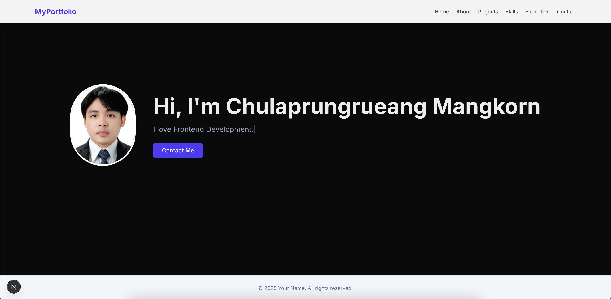

# Modern & Interactive Personal Portfolio

[](https://portfolio-omega-livid-27.vercel.app/) [](https://opensource.org/licenses/MIT)
[](https://nextjs.org/)
[](https://tailwindcss.com/)

นี่คือโปรเจกต์ Personal Portfolio ของผม สร้างขึ้นเพื่อนำเสนอทักษะ, ผลงาน, และประสบการณ์การทำงานในฐานะนักพัฒนาเว็บสมัยใหม่ โปรเจกต์นี้ไม่ได้เป็นแค่เว็บแสดงข้อมูล แต่ยังรวมฟีเจอร์ที่น่าสนใจเพื่อสร้างประสบการณ์ที่ดีให้กับผู้เยี่ยมชม


*(แนะนำ: บันทึกภาพหน้าจอโปรเจกต์ของคุณ แล้วนำไปไว้ในโฟลเดอร์ `public` และใช้ชื่อไฟล์ตามนี้ หรือจะสร้างเป็นไฟล์ GIF เพื่อโชว์การทำงานของเว็บก็ได้)*

## ✨ Key Features (ฟีเจอร์เด่น)

- **Modern UI & Responsive Design**: ออกแบบด้วยดีไซน์ที่ทันสมัยและรองรับการแสดงผลบนทุกอุปกรณ์โดยใช้ Tailwind CSS.
- **AI-Powered Chatbot**: ผู้ช่วย AI ที่สามารถตอบคำถามเกี่ยวกับข้อมูลใน Portfolio ได้ทันที โดยใช้ Google Gemini API (gemini-1.5-flash).
- **Dark/Light Mode**: รองรับการสลับ Theme เพื่อความสบายตาของผู้ใช้งาน.
- **Smooth Animations**: ใช้ `Framer Motion` เพื่อสร้าง Animation ที่สวยงามและลื่นไหล.
- **Built with Next.js App Router**: ใช้โครงสร้างล่าสุดของ Next.js เพื่อประสิทธิภาพสูงสุดและการจัดการ Routing ที่ดี.
- **Centralized Portfolio Data**: จัดการข้อมูลทั้งหมด (ประวัติ, สกิล, โปรเจกต์) จากไฟล์ส่วนกลาง (`portfolioData.js`) เพื่อให้ง่ายต่อการอัปเดตและนำไปใช้กับส่วนต่างๆ รวมถึงเป็น Context ให้กับ AI.

## 🛠️ Tech Stack (เทคโนโลยีที่ใช้)

| Category      | Technology                                                                                                |
|---------------|-----------------------------------------------------------------------------------------------------------|
| **Framework** | [Next.js](https://nextjs.org/) (v15.3.0), [React](https://react.dev/) (v19)               |
| **Styling** | [Tailwind CSS](https://tailwindcss.com/) (v4.1.8)                                               |
| **Animation** | [Framer Motion](https://www.framer.com/motion/)                                                 |
| **AI** | [Google Generative AI (Gemini)](https://ai.google.dev/)                                         |
| **Icons** | [React Icons](https://react-icons.github.io/react-icons/)                                       |
| **Linting** | [ESLint](https://eslint.org/)                                                                   |
| **Deployment**| [Vercel](https://vercel.com/)                                                                             |

## 🚀 Getting Started (การติดตั้งและเริ่มใช้งาน)

ทำตามขั้นตอนด้านล่างเพื่อติดตั้งและรันโปรเจกต์นี้บนเครื่องของคุณ

### Prerequisites (สิ่งที่ต้องมี)

- [Node.js](https://nodejs.org/en/) (แนะนำเวอร์ชัน 18.18.0 หรือสูงกว่า)
- [npm](https://www.npmjs.com/), [yarn](https://yarnpkg.com/), or [pnpm](https://pnpm.io/)

### Installation (ขั้นตอนการติดตั้ง)

1.  **Clone the repository:**
    ```bash
    git clone [https://github.com/ChuMangkorn/portfolio.git](https://github.com/ChuMangkorn/portfolio.git)
    cd portfolio
    ```

2.  **Install dependencies:**
    ```bash
    npm install
    # or
    yarn install
    # or
    pnpm install
    ```

3.  **Set up environment variables:**
    โปรเจกต์นี้ต้องใช้ API Key จาก Google AI Studio เพื่อให้ Chatbot ทำงานได้
    
    -   สร้างไฟล์ใหม่ชื่อ `.env.local` ใน root directory ของโปรเจกต์
    -   เพิ่มค่า `GOOGLE_API_KEY` ลงในไฟล์:
        ```env
        GOOGLE_API_KEY="YOUR_API_KEY_HERE"
        ```
    -   คุณสามารถรับ API Key ได้จาก [Google AI Studio](https://makersuite.google.com/).

4.  **Run the development server:**
    ```bash
    npm run dev
    ```

    เปิด [http://localhost:3000](http://localhost:3000) บนเบราว์เซอร์ของคุณเพื่อดูผลลัพธ์

## 🌐 Deployment (การนำโปรเจกต์ขึ้นโปรดักชัน)

วิธีที่ง่ายที่สุดในการ Deploy คือการใช้ [Vercel Platform](https://vercel.com/new?utm_medium=default-template&filter=next.js&utm_source=create-next-app&utm_campaign=create-next-app-readme) ซึ่งเป็นผู้สร้าง Next.js
-   อย่าลืมเพิ่ม Environment Variable `GOOGLE_API_KEY` ในหน้าตั้งค่าโปรเจกต์บน Vercel ด้วย

## 👤 Contact (ช่องทางการติดต่อ)

- **Portfolio**: [your-portfolio-url.com](https://portfolio-omega-livid-27.vercel.app/)
- **LinkedIn**: [Chulaprungrueang Mangkorn](https://www.linkedin.com/in/chulaprungrueang-mangkorn)
- **Email**: [chu.mangkorn@gmail.com](mailto:chu.mangkorn@gmail.com)

## 📄 License

โปรเจกต์นี้อยู่ภายใต้ลิขสิทธิ์ของ MIT License - ดูรายละเอียดเพิ่มเติมได้ที่ไฟล์ `LICENSE`
